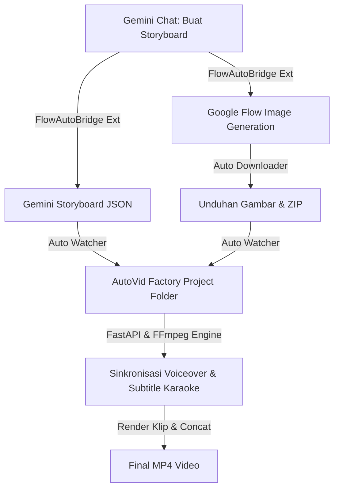

# 🎬 AutoVid Factory & FlowAutoBridge

> **Solusi Terintegrasi Terlengkap untuk Otomatisasi Produksi Video Pendek (Faceless Video) Skala Industri**

Selamat datang di repositori resmi **AutoVid Factory** & **FlowAutoBridge**. Suite aplikasi ini dirancang khusus bagi para kreator konten, agensi pemasaran, dan tim produksi media untuk menghasilkan video pendek berkualitas tinggi secara massal (mass production) dengan keterlibatan manual yang minimal.

---

## 🌟 Mengapa Memilih AutoVid Factory?

Membuat video faceless (seperti TikTok, YouTube Shorts, Reels) secara manual biasanya memakan waktu berjam-jam untuk memilah gambar, mensinkronisasi audio, mengetik subtitle karaoke, hingga menggabungkan klip. 

**AutoVid Factory memangkas proses tersebut dari jam menjadi menit.** Dengan mengintegrasikan kekuatan AI Generatif (Google Gemini & Google Flow) dan mesin render berkinerja tinggi (FFmpeg), AutoVid Factory menyatukan seluruh alur kerja Anda ke dalam satu aplikasi desktop portabel yang elegan dan mudah digunakan.

---

## 🛠️ Modul & Fitur Unggulan Utama

### 1. 🌐 FlowAutoBridge (Chrome Extension MV3)
Jembatan otomatisasi cerdas yang menghubungkan Google Gemini dan Google Flow untuk memproses storyboard gambar tanpa proses *copy-paste* manual yang melelahkan.
- **Tabel Storyboard Extractor**: Secara otomatis mengekstrak naskah cerita dan instruksi visual langsung dari sesi Gemini Chat ke berkas terstruktur `storyboard.json`.
- **Otomatisasi Input Google Flow**: Mengisi prompt gambar dan mengklik tombol generasi secara otomatis menggunakan manipulasi DOM yang presisi dan pemantauan `MutationObserver`.
- **Smart Image Downloader**: Mengunduh gambar hasil generasi secara otomatis ke subfolder unduhan yang sesuai dengan nama proyek.
- **JavaScript Obfuscation & Security**: Seluruh kode ekstensi dikompilasi menggunakan teknik obfuscation tingkat lanjut untuk keamanan dan kepatuhan penuh terhadap kebijakan Chrome Web Store (Manifest V3).

### 2. ⚡ AutoVid Factory Render Engine (FastAPI + Celery + FFmpeg)
Mesin rendering video latar belakang yang tangguh, asinkron, dan sangat efisien.
- **FFmpeg Render Engine**: Melakukan scaling, padding, dan komposisi gambar ke berbagai rasio aspek populer (9:16 Portrait, 16:9 Landscape, 1:1 Square) dengan resolusi tajam (1080p).
- **Validasi Kecocokan Suara & Naskah**: Dilengkapi sistem verifikasi berbasis **Groq Whisper API** yang mencocokkan kata kunci naskah dengan transkripsi audio voiceover (akurasi minimum 35%) guna mencegah kesalahan tertukarnya adegan audio.
- **Audio Sequential Merger**: Penggabung otomatis audio multi-part (WAV/MP3) secara berurutan menggunakan FFmpeg `concat` demuxer dengan fallback re-encoding otomatis.
- **Pembersih Storyboard Duplikat**: Otomatis mendeteksi dan menghapus berkas storyboard yang identik untuk menjaga kestabilan data render dan menghindari adegan ganda.
- **Local Caching System**: 
  - **Whisper Cache**: Menyimpan hasil transkripsi Groq Whisper lokal berbasis hash MD5 biner audio untuk menghemat kuota API.
  - **TTS Cache**: Menyimpan hasil generasi voiceover ElevenLabs/Google Cloud TTS agar tidak memakan kuota karakter pada adegan yang tidak berubah.
- **Fallback Voiceover Cerdas**: Jika kunci API ElevenLabs kosong, sistem secara otomatis beralih menggunakan Google Text-to-Speech (gTTS) gratis, dengan fallback sekunder audio hening (*silent clip*).

### 3. 🖥️ Antarmuka Premium & Pengalaman Desktop (Next.js & PyWebView)
Aplikasi desktop terintegrasi yang menghadirkan pengalaman pengguna premium.
- **PyWebView Desktop Launcher**: Berjalan sebagai jendela desktop native dengan High-DPI awareness, sistem logging terpusat (`%APPDATA%/intisariShortMovie/logs/app.log`), dan fallback otomatis ke browser bawaan jika WebView2 tidak tersedia.
- **Dashboard Render Interaktif**: Drag-and-drop file upload, progress bar adegan real-time, status logs visual, dan pemutar video (video preview player) terintegrasi.
- **Pop-up Error Modal Premium**: Jendela penanganan error yang estetik, memilah kategori masalah secara jelas, menyediakan tombol "Salin Log", dan menyajikan mitigasi pemecahan masalah yang solutif.
- **Opsi Penyimpanan Fleksibel**: Tombol "Save As" native OS, tombol pintasan "Buka Folder Lokasi Video", dan tombol "Salin Path Absolut" sekali klik.
- **Asisten Pengunduh Otomatis (Watcher Toggle)**: watcher cerdas yang memantau folder Downloads untuk langsung memindahkan file ZIP, JSON, dan WAV ke folder proyek aktif. Fitur ini dapat dinonaktifkan/aktifkan secara real-time via menu Pengaturan Sistem, dan statusnya tersimpan persisten ke disk.

---

## 🗺️ Bagaimana Cara Kerjanya?

---

## 🔒 Lisensi & Rencana Komersial

Saat ini, aplikasi dapat diuji coba tanpa lisensi berbayar untuk keperluan evaluasi fitur. Di masa mendatang, AutoVid Factory akan merilis model lisensi komersial berbasis langganan bulanan/tahunan (SaaS) atau pembelian lisensi sekali beli (*lifetime license*).

Fitur lisensi mendatang akan mencakup:
- Akses ke suara premium AI eksklusif tanpa batasan kuota.
- Template subtitle karaoke dinamis berkualitas tinggi (seperti gaya MrBeast, Alex Hormozi, dll).
- Integrasi otomatisasi langsung ke akun media sosial (Auto-Upload ke TikTok, YouTube Shorts, Reels).

---

## 🚀 Persyaratan Sistem & Instalasi

### Kebutuhan Minimum:
- **Sistem Operasi**: Windows 10/11 (64-bit)
- **Prosesor**: Intel Core i3 / AMD Ryzen 3 atau lebih tinggi
- **Memori**: 8 GB RAM
- **Penyimpanan**: 500 MB ruang kosong (FFmpeg portabel sudah termasuk di dalam installer)

### Cara Memulai:
1. Unduh installer terbaru `intisariShortMovie-Setup.exe` dari tab **Releases** di repositori publik ini.
2. Jalankan berkas Setup dan ikuti petunjuk instalasi di layar.
3. Setelah selesai, buka aplikasi dari shortcut desktop Anda.
4. Buka menu **Pengaturan (ikon ⚙️)** di kanan atas untuk memasukkan API Key Anda (seperti Groq Whisper API Key) guna mulai merender video pertama Anda.
